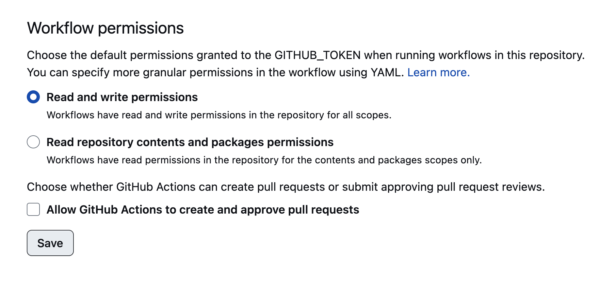

I've spend the past 48 hours learning [Hugo](https://gohugo.io/) and stumbled upon a few useful resources that might help others who want to learn. 

## Should you use Hugo?

If you need a simple blog or portfolio site and have little experience writing code, Hugo is probably not for you. Checkout simpler static site generators like [Jekyll](https://docs.github.com/en/pages/setting-up-a-github-pages-site-with-jekyll/about-github-pages-and-jekyll) and [11nty](https://www.11ty.dev/) instead. 
 
 [This article](https://arun.is/blog/choosing-a-static-site-generator/) from a product designer name Arun helped me narrow down the choices for a static site generator. "Stick with what's familiar" and "Find a generator with plenty of support" are key. 

Honestly, Hugo is more complicated than *what I even need* but I had a few goals that made the experience valuable to me (so far). I wanted to... 

1. build a portfolio site that is simple and accessible
2. move my existing Squarespace site to <a target="_blank" href="https://pages.github.com/">Github Pages</a> to save on hosting costs
3. get back into learning web development

Hugo has a steep learning curve and the documentation needs *a lot* of work, but I was looking for a challenge and that's what I got. I still haven't figured it out yet 😅.

## Consider starting with a theme

As of this blog post, I'm using the [Congo](https://jpanther.github.io/congo/docs/) theme, because I wanted to use [Tailwind CSS](https://tailwindcss.com/) and it has 600+ followers with an active community. Just today, the creator responded to my three different annoying questions (Hi, James! Thank you! 🙏). Because Hugo's documentation is confusing, I thought it would be helpful to learn with a theme so I can understand best practices. 

It took me hours to figure out, but it's best to use a [module for adding a theme](https://gohugo.io/hugo-modules/use-modules/#use-a-module-for-a-theme) to your project rather than submodules. A lot of website tutorials haven't updated their documentation yet, but it's Hugo's recommended method for adding themes now.

Modules make it easier to...
1. swap themes in the future
2. easily upgrade the theme when updates release 
3. protect you from yourself so you don't edit the original theme files 

And guess what? If you re-clone your repository that uses the submodule method, your theme's submodules need to be updated too. That took me about 4 hours to figure out. Thank you [double-beep](https://stackoverflow.com/a/65745209) on stack overflow. 

Learn more about the pros and cons of setting up a theme from [Nicholas Gracilla](https://stackoverflow.com/a/65745209). 

## Auto deploying a Hugo site to Github Pages 

Okay, this was an absolute b*t$h to figure out but my site now auto-deploys to my `gh-pages` branch using Git Workflows/Actions.

First, follow Hugo's tutorial on how to [host on GitHub](https://gohugo.io/hosting-and-deployment/hosting-on-github/). 

Second, make sure your Workflow Permissons for the your project is set to `Read and write permissions`: 
1. Go to your project settings in Github 
2. Click on Actions, and then General
3. Scroll to the bottom to change your default Workflow permissions

## That's all (for now)

As I mentioned, I just started learning two days ago but I'm enjoying the Hugo experience using the open source [Congo](https://jpanther.github.io/congo/docs) theme.

Even if you don't use this theme, Congo's documentation is a great way to understand the basics of how Hugo works.

Happy Hugo-ing?! 🏄‍♀️

